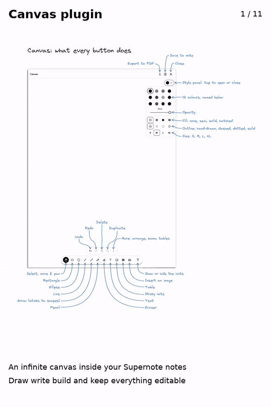
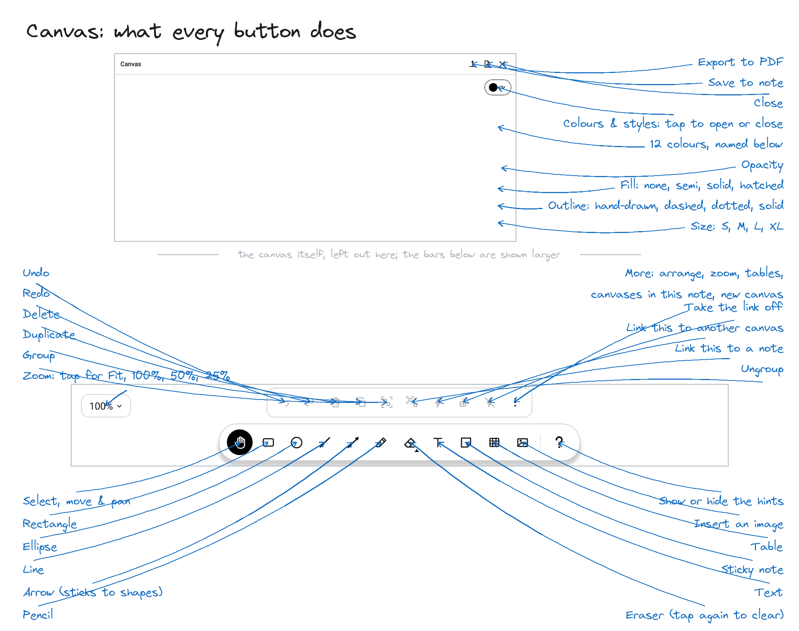

# Canvas Plugin for Supernote

[](https://github.com/j-raghavan/sn-canvas/actions/workflows/ci.yml)


[](LICENSE)
[](https://github.com/j-raghavan/sn-canvas/releases)

An infinite canvas inside your Supernote notes. Sketch diagrams, build tables and sticky-note boards, drop in images, then save a thumbnail of the canvas into your page. Tap that thumbnail later and the canvas opens again exactly as you left it, still fully editable.



## What every button does



## Features

### An infinite canvas inside your notes
- **Endless space.** Pinch with two fingers to zoom (5% to 2000%), drag with the hand tool to pan. A minimap shows where you are while you move.
- **Palm rejection.** With a drawing tool, only the pen draws, just like Supernote's own notes. A hand resting on the screen never leaves a mark.
- **First-run hints.** Every time Canvas opens, hand-drawn hints point at each control. Touch the canvas or pick a tool to dismiss them; tap **?** to bring them back.

### Drawing and building blocks
- **Pencil** with pen pressure, inked by Supernote's own pen engine, so it keeps up with your writing like native notes.
- **Rectangle, ellipse, line and arrow.** Arrows attach to shapes and follow them when a shape moves.
- **Eraser.** Tap or drag over items to delete them as one undoable step. The pen's eraser end works with any tool. Tap the eraser again, once it is the tool, for **Clear canvas**: the whole canvas at once, after a confirmation, and Undo brings it back.
- **Text boxes and sticky notes**, typed with the on-screen keyboard.
- **Tables.** Drag out a grid of up to 12 rows × 8 columns, tap a cell to type, and add or remove rows and columns later.
- **Images.** Insert a PNG, JPG or WebP from your files, then move, resize (keeping proportions) and rotate it. The image is copied into the canvas, so the canvas never depends on the original file.

### Editing
- Select, move, resize and rotate anything. Undo and redo, delete, duplicate.
- **Select several at once:** with the hand tool, drag a rectangle over them with the pen. Everything it touches is selected, and dragging any of them moves the lot. Delete, duplicate, z-order and styles all apply to the whole selection; resizing and rotating stay one item at a time.
- **Group them:** with several selected, **Group** in the ⋮ menu makes them one. Tapping any member selects the whole group, and it moves, copies and deletes as one until you **Ungroup** it.
- From the **⋮** menu: bring to front or send to back, zoom to fit or to 100%, table rows and columns, **Clear canvas** (also under the eraser) and **New canvas**.
- **Style panel:** 12 colours, opacity, fill (none, semi, solid, hatched), outline (hand-drawn, dashed, dotted, solid; images can also have none) and four sizes (S, M, L, XL). Picking a style changes the selected item and becomes the default for new ones.
- On screen, colours are drawn as distinct e-ink grays; the note thumbnail and the PDF keep the true colours.

### Working with your notes
- **Save to Note** drops a thumbnail of the canvas into the current page. Lasso the thumbnail and tap **Open Canvas** to reopen that canvas, framed to fit its content.
- Every thumbnail links to its own canvas, so one note can hold as many canvases as you like.
- **Export to PDF:** the whole canvas on one page fitted to its content, in true colour with images included.
- Closing Canvas saves it. Canvases are stored as structured, re-editable data, never flattened into ink.

## Requirements

- A Supernote with plugin support in the Notes app. Canvas is built against `sn-plugin-lib` 0.1.65 and developed on a **Supernote Nomad** running **Chauvet** firmware.
- About 12 MB of storage for the plugin, plus your canvases.

## Installing

1. Download `SnCanvas.snplg` from the [latest release](https://github.com/j-raghavan/sn-canvas/releases) (or [build it yourself](#building-from-source)).
2. Copy it to the **MyStyle** folder on your Supernote, using the Supernote Partner app, a USB cable, or `adb push`.
3. On the Supernote, go to **Settings → Apps → Plugins → Choose Installation Package**, open **MyStyle** and pick `SnCanvas.snplg`.

**Updating:** in the same **Plugins** screen, remove the installed Canvas first, then install the new package. Your canvases are kept: they live in `MyStyle/SnCanvas`, not inside the plugin.

### Permissions

The first time Canvas opens it asks for file access, once:

| Permission | Why |
|---|---|
| Read files | Load your canvases and the images inside them |
| Write files | Save canvases and note thumbnails, copy inserted images into the canvas, write PDF exports |
| Delete files | Remove the unsaved scratch canvas once Save to Note turns it into a linked canvas (or clean up if that fails), and move canvases saved by older versions into `MyStyle/SnCanvas` |

## How to use

1. Open a note, open the **Plugins** list in the sidebar, and tap **Canvas**.
2. Pick a tool from the floating toolbar at the bottom and draw with the pen.
3. Tap the round colour button at the top right to open the style panel.
4. Tap **Save to Note** (the page-with-plus icon in the header) to put a thumbnail of the canvas into your page. A notice confirms it was added.
5. Later, lasso that thumbnail in the note and tap **Open Canvas** to carry on where you left off.
6. **Export to PDF** (the upward-arrow icon) saves the canvas to your `EXPORT` folder; a notice names the file.
7. Tap **✕** to close. The canvas is saved as it closes.

### Gestures

| Gesture | What it does |
|---|---|
| Pen, with a drawing tool | Draws; your palm and fingers are ignored |
| Finger, with the hand tool | Selects and moves items; drag on empty space to pan |
| Pen, with the hand tool | The same, but a drag on empty space pulls out a selection rectangle |
| Two fingers | Pinch to zoom |
| The pen's eraser end | Erases, whichever tool is selected |
| Tap selected text, a note or a table cell | Opens the keyboard to edit it |

## Where your work is saved

| What | Where on the device |
|---|---|
| Canvases | `MyStyle/SnCanvas/c-<id>.json` |
| Images inside canvases | `MyStyle/SnCanvas/images/` |
| Note thumbnails | `MyStyle/SnCanvas/thumbnails/` |
| PDF exports | `EXPORT/Canvas-<yyyymmdd>-<hhmmss>.pdf` |

## Tips and known limitations

- **Typed text only.** Text boxes, sticky notes and table cells use the on-screen keyboard. Supernote's handwriting recognition only reads the note's own ink, not strokes drawn inside a canvas.
- **Light colours look pale on screen.** Each colour gets its own gray so they stay distinguishable on e-ink, which makes yellow and the light colours quite light. The PDF and the note thumbnail use true colour.
- **Some e-ink ghosting while panning.** A faint trace of the previous frame can linger until the screen refreshes.
- **PDF export covers the whole canvas.** Exporting only part of a canvas is not supported yet.

## Building from source

Prerequisites:
- Node.js 20 and npm
- The Android SDK, with the NDK and CMake installed (`sn-plugin-lib` builds a small native library)
- A JDK is not needed up front: Gradle downloads a matching one on first build
- Python 3 with Pillow, only if you want to redraw the icons or hint images

```sh
npm ci
./buildPlugin.sh
```

This produces `build/outputs/SnCanvas.snplg`. To put it on a connected device for installing:

```sh
adb push build/outputs/SnCanvas.snplg /storage/emulated/0/MyStyle/
```

## Development

```sh
npm test               # Jest, with a 97% coverage gate
npm run lint           # ESLint
npm run typecheck      # TypeScript
```

The canvas itself is native Kotlin, with its own unit tests and style checks:

```sh
cd android
./gradlew :app:testDebugUnitTest :app:ktlintCheck :app:detekt
```

`style-catalog.json` lists the style panel's colours, fills, outlines and sizes; both the TypeScript and the Kotlin tests check their copy against it, so the two sides can't drift apart.

To redraw the toolbar icons or the hint images after editing their generators:

```sh
python3 scripts/draw_icons.py
python3 scripts/draw_hints.py
```

### CI and releases

- **CI** runs lint, tests and a full plugin build on every push to `main` and `feat/*` and on pull requests to `main`. Each run keeps the built `SnCanvas.snplg` as a downloadable artifact.
- **Releases** are manual: **Actions → Release → Run workflow**. Leave the version blank to bump the patch number of the latest tag, or type one (e.g. `1.2.0`). The workflow runs lint and tests, builds the plugin, commits the version bump, tags it, and publishes a GitHub Release with `SnCanvas.snplg` and release notes listing the changes and contributors.

## Project structure

```
index.js              Plugin entry: registers the "Canvas" sidebar button and the "Open Canvas" lasso button
App.tsx               React Native root component
src/
  wiring.ts           Connects the canvas session to the device
  application/        The canvas session: open, save to note, insert images, export PDF, close
  domain/             Pure logic: styles, linking canvases to notes, the link index, text editing
  infrastructure/     Supernote SDK adapters: host calls, file permissions, button routing, storage
  ui/                 The screen, toolbar, action bar, style panel, text editor and onboarding hints
android/app/src/main/java/com/sncanvas/canvas/
                      The native canvas (Kotlin): model, geometry, gestures, rendering, pen ink,
                      PDF export and persistence
assets/               Toolbar icons and hint images
scripts/              Icon and hint generators, and the Virgil font they use
__tests__/            Jest tests
docs/images/          README images
```

## Credits

- The hints and labels use **Virgil**, Excalidraw's hand-drawn font, under the SIL Open Font License 1.1 (see `scripts/fonts/Virgil-OFL.txt`).
- The colour palette and style options follow [tldraw](https://tldraw.com)'s.

## License

[MIT](LICENSE). The Virgil font in `scripts/fonts` keeps its own licence, the SIL Open Font License 1.1.

---

Hope you enjoy using this plugin as much as I enjoyed building it. If you find any issues, please raise an [Issue](https://github.com/j-raghavan/sn-canvas/issues).
